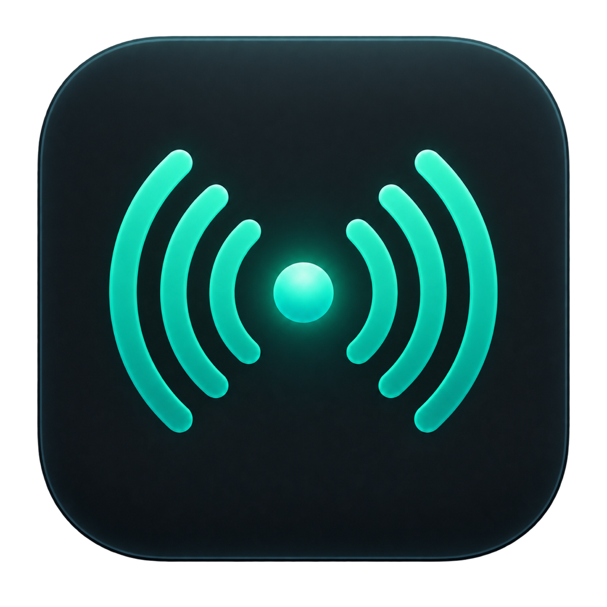
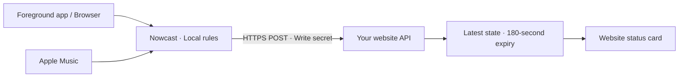

<p align="center">
  
</p>

<h1 align="center">Nowcast</h1>

<p align="center"><strong>A little signal of right now.</strong><br>Bring your current Mac activity and music to your personal website.</p>

<p align="center">
  <a href="https://github.com/Moyuin-aka/Nowcast/releases/latest">Download</a> ·
  <a href="#getting-started">Getting started</a> ·
  <a href="#connect-your-website">Website integration</a> ·
  <a href="#development-and-contributing">Contributing</a>
</p>

<p align="center">
  
  
  
  <a href="LICENSE"></a>
</p>

<p align="center"><a href="README.md" lang="zh-CN">简体中文</a> · <strong>English</strong></p>

Nowcast is a macOS menu bar app. It turns your foreground app, browser site, and Apple Music playback into a short description on your Mac, then sends it over HTTPS to an API you choose. Your website reads the latest state without rebuilding whenever your activity changes.

Here is an example of what your website could display. The receiver controls the presentation:

```text
● Writing · Obsidian
  For 23 minutes
  ♫ Example song — Example artist
```

## What right now can look like

The bundled activity labels are currently in Chinese. These are their English meanings; you can change the wording in your rules.

| Activity on your Mac | Default description (translated) |
| --- | --- |
| VS Code | Coding |
| Terminal, iTerm2, Ghostty, Warp, Cursor | Vibe Coding |
| Obsidian | Writing |
| Configured sites such as GitHub, Bilibili, and Xiaohongshu | Browsing the named site |
| Configured apps or sites such as Claude and ChatGPT | Chatting with AI |
| Apple Music in the background | Track, artist, and album, alongside foreground activity |

- **At home in the menu bar**: preview your status, pause sharing, and optionally launch at login.
- **In your own words**: edit app and domain rules. Unknown apps produce no activity; unknown sites use a generic browsing label.
- **Built for everyday switching**: a 3-second debounce and 60-second heartbeat. After a connection loss, only the latest state is retained, with no historical replay.
- **For your own website**: a small JSON protocol that works with different frameworks, databases, and hosting providers.

## Getting started

1. Download the universal DMG from [Releases](https://github.com/Moyuin-aka/Nowcast/releases/latest), for Apple Silicon and Intel.
2. Open the DMG, drag **Nowcast** to **Applications**, and launch it. Open **状态与设置…** (Status & Settings) from the menu bar.
3. Sharing is paused on first launch. Enter your API endpoint and write secret, click **保存设置** (Save Settings), then **开始共享** (Start Sharing). Leave the endpoint empty to preview locally first.
4. Allow macOS Automation access when prompted to read your browser or Music, if you want those features. Launch at login is opt-in.

The app's interface is currently in Chinese; the labels below help you find each setting.

| Setting | What to enter or enable |
| --- | --- |
| API 地址 — API endpoint | An HTTPS endpoint implementing the Nowcast protocol, such as `https://example.com/api/presence` |
| 写入密钥 — Write secret | The shared secret configured on your receiver. Stored in macOS Keychain; leaving it blank when saving keeps the existing secret |
| 识别浏览器中的网站 — Identify browser sites | Generate activity descriptions using domain rules |
| 显示后台 Apple Music — Share Apple Music | Include the currently playing track |

Pause sharing before changing your connection settings or rules. Your website needs a receiver implementation; entering its homepage URL alone will not connect it.

### If macOS blocks the first launch

Current releases are ad-hoc signed, without Apple Developer ID signing or notarization. If macOS cannot verify the developer, confirm you downloaded the app from this repository and moved it to Applications, then open **Terminal** and run:

```sh
xattr -dr com.apple.quarantine /Applications/Nowcast.app
open /Applications/Nowcast.app
```

This removes the download quarantine flag from Nowcast itself and launches the app. It does not disable Gatekeeper globally. You may need to repeat this after downloading a new version.

## You choose what becomes public

Apps and domains are matched locally. Only activity descriptions from your rules and information about the playing track are uploaded. The protocol excludes raw URLs, window titles, document contents, terminal commands, and browsing history. The write secret is not stored in the JSON configuration file.

When you pause sharing or your Mac sleeps, the client attempts to send an empty state. Receivers should use a **180-second expiry** so old activity disappears even if the connection drops. Nowcast is designed for one user's current presence on a single Mac.

Site identification supports Safari, Chrome, Edge, Arc, and Brave. Firefox does not yet support tab-level identification; permissions and compatibility depend on the browser version. Recognizing a site does not mean a video is playing. Music comes only from the local Music.app; album artwork, playback progress, and iPhone playback are not currently supported.

## Connect your website



The receiver provides an authenticated write endpoint and lets your page read unexpired state. Here is a synthetic request example:

```http
POST /api/presence
Content-Type: application/json
x-now-playing-secret: <your-secret>
```

```json
{
  "version": 1,
  "activity": {
    "kind": "writing",
    "title": "Writing",
    "source": "Obsidian",
    "startedAt": "2026-09-15T10:00:00Z"
  },
  "music": null,
  "observedAt": "2026-09-15T10:23:00Z"
}
```

`activity` and `music` are independent channels and must both appear in every request. Setting both to `null` clears the state. `startedAt` preserves the activity's start time; `observedAt` identifies the current sample. The client treats any `2xx` response as success.

Receivers must authenticate writes, validate an allowlisted schema, reject stale and out-of-order requests, calculate expiry from server receipt time, and keep the write secret out of browser code. See [Protocol v1](docs/protocol-v1.md) and the [receiver contract](docs/integrations.md) for the full requirements. Receiver implementations and deployment configuration belong in their respective website repositories.

## Customize your rules

Pause sharing, click **编辑规则** (Edit Rules), edit `~/Library/Application Support/Nowcast/config.json`, save it, and click **重新载入** (Reload). For example, add or update this entry inside the existing `apps` object:

```json
"md.obsidian": { "kind": "writing", "title": "Organizing ideas", "source": "Obsidian" }
```

`apps` matches application bundle IDs. `domains` matches a domain and its subdomains, with more specific domains taking priority. Preserve the other fields and rules in your file, and edit only the entries you need.

Supported `kind` values are `coding`, `vibe`, `writing`, `ai`, `browsing`, `reading`, `video`, `game`, and `other`. These categories are available for custom mappings; they do not imply automatic detection of every kind of content.

## Development and contributing

Use macOS with a full Xcode toolchain. Nowcast is built with Swift, AppKit, and SwiftUI, with no third-party runtime dependencies.

```sh
git clone https://github.com/Moyuin-aka/Nowcast.git
cd Nowcast
swift test
bash scripts/package.sh native
open dist/Nowcast.app
```

Build a universal package for Apple Silicon and Intel:

```sh
bash scripts/package.sh universal
```

The app, DMG, and SHA-256 checksum file are written to `dist/`. Use the packaged `.app` to verify system permissions and launch-at-login behavior; `swift run` does not represent the distributed app.

| Path | Purpose |
| --- | --- |
| `Sources/Nowcast/` | Menu bar, settings, collection, storage, and uploads |
| `Sources/NowcastCore/` | Protocol, rules, and debounce logic |
| `Tests/NowcastCoreTests/` | Core behavior tests |
| `Resources/`, `scripts/` | Icon, app metadata, and packaging tools |
| `docs/` | Protocol, integration, and release documentation |

Issues and PRs are welcome. Read the [repository guidelines](AGENTS.md) and [development notes](DEVELOPMENT.md) (in Chinese) before making changes. Validate with synthetic data and report your test results. `VERSION` is the single version source; a matching `vX.Y.Z` tag triggers a DMG build and GitHub Release. Signing is optional; see the [release guide](docs/releasing.md).

## License

[MIT](LICENSE) © Nowcast contributors
