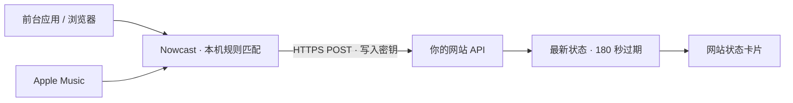

<p align="center">
  
</p>

<h1 align="center">Nowcast · 此刻</h1>

<p align="center"><strong>把此刻，轻轻广播。</strong><br>将 Mac 上的当前活动与音乐，变成个人网站上的实时状态。</p>

<p align="center">
  <a href="https://github.com/Moyuin-aka/Nowcast/releases/latest">下载</a> ·
  <a href="#开始使用">开始使用</a> ·
  <a href="#接入你的网站">网站接入</a> ·
  <a href="#开发与贡献">开发与贡献</a>
</p>

<p align="center">
  
  
  
  <a href="LICENSE"></a>
</p>

<p align="center"><strong>简体中文</strong> · <a href="README.en.md" lang="en">English</a></p>

Nowcast 是一款 macOS 菜单栏应用。它在本机把前台应用、浏览器网站和 Apple Music 播放状态整理成简短描述，通过 HTTPS 发送到你指定的 API。网站读取最新状态即可更新展示，无需因活动变化重新构建。

下面是网站可以呈现的内容示例，具体样式由接收端决定：

```text
● 正在写作 · Obsidian
  已持续 23 分钟
  ♫ Example song — Example artist
```

## 此刻，可以是什么

| Mac 上的活动 | 默认公开描述 |
| --- | --- |
| VS Code | 写代码 |
| Terminal、iTerm2、Ghostty、Warp、Cursor | Vibe Coding |
| Obsidian | 写作 |
| 浏览 GitHub、B站、小红书等已配置网站 | 逛 GitHub、逛 B站、刷小红书 |
| Claude、ChatGPT 等已配置应用或网站 | 与 AI 聊天 |
| 后台 Apple Music | 歌曲、歌手与专辑，可与前台活动同时展示 |

- **留在菜单栏**：查看当前状态、暂停共享，按需开启登录启动。
- **用自己的表达**：应用与域名规则可编辑；未知应用不生成活动，未知网站显示「浏览网页」。
- **适应日常切换**：3 秒防抖、60 秒心跳；断网只保留最新状态，不补传历史。
- **接入自己的网站**：使用小而明确的 JSON 协议，兼容不同框架、数据库与托管平台。

## 开始使用

1. 从 [Releases](https://github.com/Moyuin-aka/Nowcast/releases/latest) 下载 universal DMG，支持 Apple Silicon 与 Intel。
2. 打开 DMG，将 **Nowcast** 拖入 **Applications（应用程序）**，再启动应用。运行后从菜单栏访问「状态与设置…」。
3. 初次启动默认暂停共享。填写 API 地址与写入密钥，点击「保存设置」，再「开始共享」。地址留空时也可以先在本机预览。
4. 首次读取浏览器或 Music 时，按需允许 macOS「自动化」权限；登录启动需手动开启。

| 设置 | 填写方式 |
| --- | --- |
| API 地址 | 实现 Nowcast 协议的 HTTPS 端点，例如 `https://example.com/api/presence` |
| 写入密钥 | 接收端配置的共享密钥；保存在 macOS Keychain，留空保存可保留已有密钥 |
| 识别浏览器中的网站 | 按域名规则生成活动描述 |
| 显示后台 Apple Music | 同时分享正在播放的歌曲 |

修改连接设置或规则前，请先暂停共享。网站需要自行实现接收端；仅填写网站首页地址无法接入。

### 首次打开被 macOS 阻止

当前发布包使用 ad-hoc 签名，尚未经过 Apple Developer ID 签名与公证。如果 macOS 无法验证开发者，确认下载来自本仓库并已将应用拖入 Applications 后，打开 **Terminal（终端）**运行：

```sh
xattr -dr com.apple.quarantine /Applications/Nowcast.app
open /Applications/Nowcast.app
```

这会移除 Nowcast 自身的下载隔离标记并启动应用，不会全局关闭 Gatekeeper。重新下载或升级后可能需要再次执行。

## 公开什么，由你决定

应用与域名在本机匹配，只上传规则中的活动描述及播放中的歌曲信息。协议不包含原始 URL、窗口标题、文档正文、终端命令或浏览历史；写入密钥不会写入 JSON 配置文件。

暂停共享或休眠时，客户端尝试发送空状态。接收端应设置 **180 秒过期时间**，确保网络中断后旧状态也会消失。Nowcast 面向单用户、单台 Mac 的当前状态分享。

浏览器支持 Safari、Chrome、Edge、Arc、Brave 的网站识别；Firefox 暂无标签页细分适配，权限与兼容性取决于浏览器版本。网站识别不代表视频正在播放。音乐仅来自本机 Music.app，暂不提供封面、播放进度或 iPhone 播放状态。

## 接入你的网站



接收端提供一个受保护的写入接口，并让页面读取未过期的状态。以下为合成请求示例：

```http
POST /api/presence
Content-Type: application/json
x-now-playing-secret: <your-secret>
```

```json
{
  "version": 1,
  "activity": {
    "kind": "writing",
    "title": "写作",
    "source": "Obsidian",
    "startedAt": "2026-09-15T10:00:00Z"
  },
  "music": null,
  "observedAt": "2026-09-15T10:23:00Z"
}
```

`activity` 与 `music` 是独立通道，必须同时出现在请求中；两者为 `null` 表示清空状态。`startedAt` 保留活动起始时间，`observedAt` 表示本次采样时间。客户端将任意 `2xx` 视为成功。

接收端必须验证密钥与字段白名单、拒绝过期和乱序请求、使用服务器接收时间计算过期，并保护写入密钥不进入浏览器代码。完整字段与行为见 [协议 v1](docs/protocol-v1.md) 和 [接收端约定](docs/integrations.md)。接收端实现与部署配置维护在各自的网站仓库中。

## 自定义规则

暂停共享，点击「编辑规则」，修改 `~/Library/Application Support/Nowcast/config.json`，保存后点击「重新载入」。例如，在已有 `apps` 对象中添加或修改以下条目：

```json
"md.obsidian": { "kind": "writing", "title": "整理想法", "source": "Obsidian" }
```

`apps` 按应用 bundle ID 匹配，`domains` 按域名及其子域匹配，更具体的域名优先。保留文件中的其他字段与规则，仅修改需要的条目。

`kind` 支持 `coding`、`vibe`、`writing`、`ai`、`browsing`、`reading`、`video`、`game`、`other`；这些类别可用于自定义映射，不表示客户端自动识别所有对应内容。

## 开发与贡献

使用 macOS 与完整 Xcode 工具链。项目基于 Swift / AppKit / SwiftUI，无第三方运行时依赖。

```sh
git clone https://github.com/Moyuin-aka/Nowcast.git
cd Nowcast
swift test
bash scripts/package.sh native
open dist/Nowcast.app
```

构建 Apple Silicon + Intel 通用包：

```sh
bash scripts/package.sh universal
```

产物位于 `dist/`：应用、DMG 和 SHA-256 校验文件。请使用打包后的 `.app` 验证系统权限与登录启动；直接 `swift run` 不能代表分发版行为。

| 路径 | 职责 |
| --- | --- |
| `Sources/Nowcast/` | 菜单栏、设置、采集、存储与上报 |
| `Sources/NowcastCore/` | 协议、规则与防抖逻辑 |
| `Tests/NowcastCoreTests/` | 核心行为测试 |
| `Resources/`、`scripts/` | 图标、应用元数据与打包工具 |
| `docs/` | 协议、接入和发布说明 |

欢迎提交 Issue 与 PR。开发前请阅读 [仓库约定](AGENTS.md) 与 [开发交接](DEVELOPMENT.md)，使用合成数据验证，并说明测试结果。`VERSION` 是唯一版本源；匹配的 `vX.Y.Z` tag 会触发 DMG 构建与 Release，签名为可选能力，详见 [发布说明](docs/releasing.md)。

## License

[MIT](LICENSE) © Nowcast contributors
